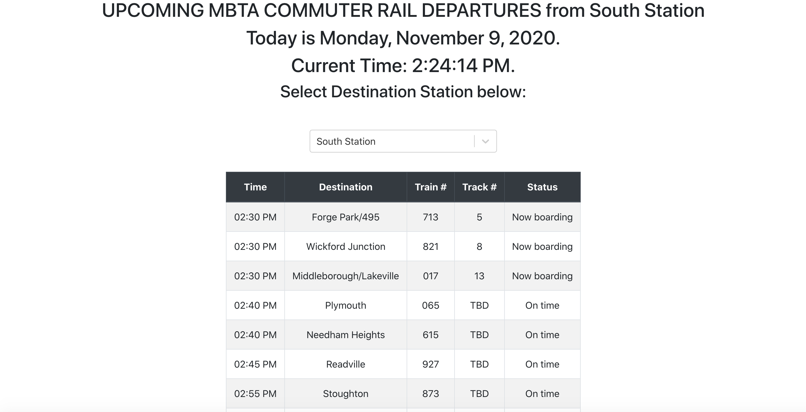

# MBTA Commuter Rail Departure Schedule App

This project was bootstrapped with [Create React App](https://github.com/facebook/create-react-app).

Application shows the upcoming departures at North and South stations, the train destinations, the departure times, the track numbers, and the boarding status (e.g. 'Boarding', 'All Aboard', 'Delayed'). 

Can pick from dropdown between north/south stations and data will update, auto update happens around every minute.

## Instructions:

Project can be run locally by running `npm install` and `npm start` (details below).

For optimal running of project + its dependencies, please use Node.js LTS (v14.15.0)

`NOTE:` API Base URL hidden behind .env file, can create .env file after installing dependencies at root directory of project and make `BASE_API_URL` variable equal to publically available api host address(found via API docs): `https://api-v3.mbta.com/`

## Available Scripts

In the project directory, you can run:

### `npm install`

Installs dependencies used in project

### `npm start`

Runs the app in the development mode.\
Open [http://localhost:3000](http://localhost:3000) to view it in the browser.

The page will reload if you make edits.\
You will also see any lint errors in the console.

## Additional Info:

Project built using Node.JS LTS v14.15.0 using nvm with react v17.0.1

You can learn more in the [Create React App documentation](https://facebook.github.io/create-react-app/docs/getting-started).

To learn React, check out the [React documentation](https://reactjs.org/).

## Screenshots:

### North Station
#### 1:

### South Station
#### 1:

#### 2:

## Points of Improvement
-   split out components (ex. break up OutputTable into API data processing, UI components)
-   better handle edge cases like reschedules or no data to pull 
    - separate component to handle different cases better like:
      - api call error
      - no data returned (no trains running)
-   using separate css classes/files to style
-   style overall application beyond bootstrap/basic text
-   include using API Key for API calls and setting up node server to handle calls with authorization key
